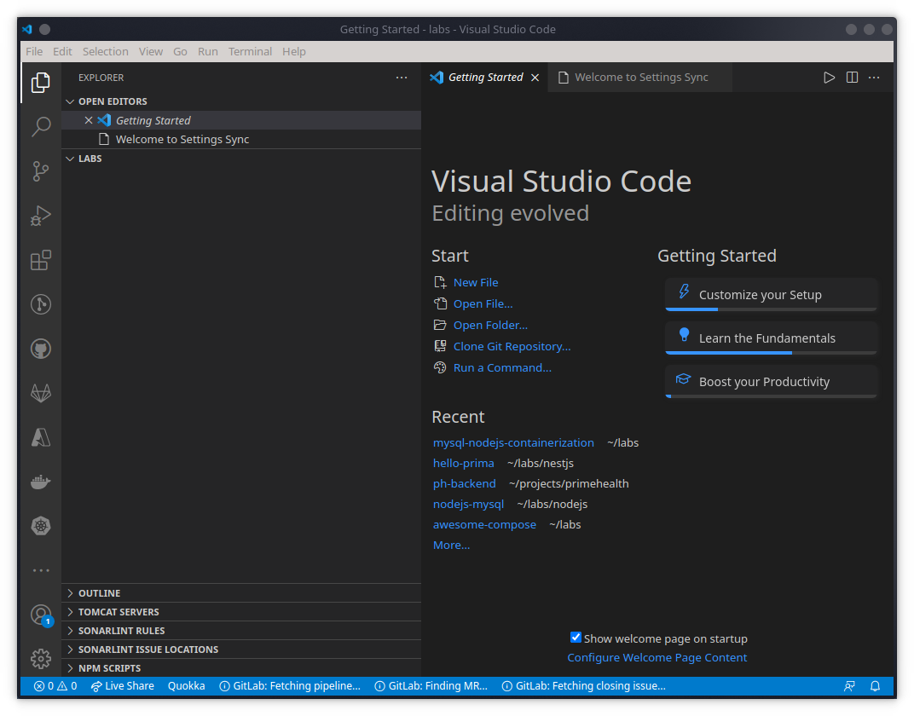
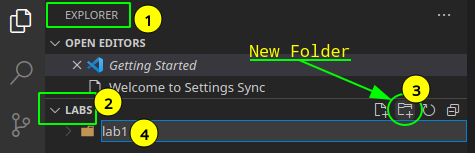
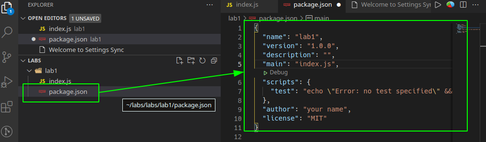
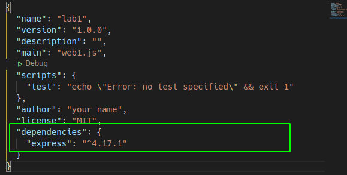
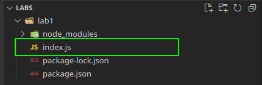

# Lingkungan Pengembangan Aplikasi

<!-- @import "[TOC]" {cmd="toc" depthFrom=1 depthTo=6 orderedList=false} -->

<!-- code_chunk_output -->

- [Lingkungan Pengembangan Aplikasi](#lingkungan-pengembangan-aplikasi)
  - [Tujuan Instruksional Khusus:](#tujuan-instruksional-khusus)
  - [Kebutuhan Perangkat Lunak:](#kebutuhan-perangkat-lunak)
  - [Instruksi](#instruksi)
    - [Langkah 1: Menguji lingkungan Pengembangan (15 menit)](#langkah-1-menguji-lingkungan-pengembangan-15-menit)
    - [Langkah 2: Inisialisasi Web Aplikasi dengan NodeJS (15 menit)](#langkah-2-inisialisasi-web-aplikasi-dengan-nodejs-15-menit)
    - [Langkah 3: Membuat minimal web aplikasi (15 menit)](#langkah-3-membuat-minimal-web-aplikasi-15-menit)

<!-- /code_chunk_output -->

## Tujuan Instruksional Khusus:
- Setelah menyelesaikan instruksi pada setiap langkah, Peserta akan dapat menggunakan lingkungan pengembangan untuk menulis program dengan NodeJS, MySQL dan menjalankannya.

## Kebutuhan Perangkat Lunak:
- Desktop/Laptop dengan Windows 10.
- Terinstal Integrated Development Environment (IDE) misal: VSCode
- Terinstal nodejs dan npm
- Terinstal curl
- Terinstal MySQL server dan client
- Terinstal docker
- Terinstal docker-compose

## Instruksi

### Langkah 1: Menguji lingkungan Pengembangan (15 menit)
- Aktikan PowerShell
```
c:\>
```

- Apakah NodeJS dan NPM sudah Terinstal ?
```
c:\> node -v
c:\> npm -v
```

- Apakah curl sudah Terinstal?
```
c:\> curl --version
```

- Apakah MySQL Client dan Server sudah Terinstal?

```
c:\> mysql --version
c:\> mysql -uroot -p
mysql> CREATE DATABASE mydb;
mysql> SHOW DATABASES;
mysql> exit;
c:\>
```

- Apakah docker sudah Terinstal?
```
c:\> docker -v
c:\> docker images
c:\> docker ps -a
c:\> docker run hello-world
c:\> docker ps -a
```

- Apakah docker-compose sudah Terinstal ?
```
c:\> docker-compose -v
c:\> dir *.yml
c:\> $yml=@"
version: "3.9"
services:
    hello:
        image: hello-world:latest
"@ > hello.yml
c:\> dir *.yml
c:\> docker-compose -f hello.yml up
c:\> docker-compose -f hello.yml ps
c:\> docker-compose -f hello.yml down
c:\> docker-compose -f hello.yml ps

```

- Apakah Visual Code (VSCode) sudah Terinstal?
```
c:\> code .
<Setelah vscode aktif, keluar dengan ctrl-q >
```

> Catatan:
> - Jika terdapat Error pada setiap instruksi diatas, hubungi fasilitator
> - Fasilitator akan memberitahukan username dan password untuk akses ke mysql.
> - Untuk menghubungi fasilitator, gunakan public chat yang tersedia, sertakan nama, mesin yang digunakan, penjelasan singkat masalah yang dihadapi. Fasilitator akan segera membantu.

### Langkah 2: Inisialisasi Web Aplikasi dengan NodeJS (15 menit)
- Buat folder untuk mengorganisasikan kumpulan berkas yang akan dibuat untuk pengembangan web aplikasi.

```
c:\> md c:\labs
c:\> cd c:\labs\
```

- Aktifkan VSCode pada folder yang baru dibuat:

```
c:\> code .
```
> Catatan:
> - Sertakan "." pada akhir perintah **code**.



- Buat Folder baru dengan nama "**lab1**" untuk menyimpan berkas-berkas yang akan dibuat untuk lab pertama.



> Catatan:
> 1. Arahkan mouse pada bagian "EXPLORER"
> 2. Buka (*Expand*) **LABS** jika masih Tertutup (*Collaps*)
> 3. Click Icon "New Folder"
> 4. Masukkan nama folder yang akan dibuat: "lab1"


- Aktifkan terminal dengan menekan tombol ctrl-` (control backquotes - terletak diatas tombol tab) dan pastikan folder yang aktif adalah lab1, jika selainnya aktifkan folder lab1.

```
c:\> cd
..\lab
c:\> dir
c:\> cd lab1
c:\> cd
..\lab1
```

- Inisialisasi aplikasi nodejs, dengan menggunakan **npm init**, dan penuhi masukan seperti contoh dibawah ini:
    - package name: lab1, atau enter untuk nilai tetap
    - version: 1.0.0, atau enter untuk nilai tetap
    - description: \<kosong>, silahkan tambahkan penjelasan atau enter untuk nilai tetap
    - entry point: index.js, atau enter untuk nilai tetap
    - test command: \<kosong>, enter untuk nilai tetap
    - git repository: \<kosong>, enter untuk nilai tetap
    - keywords: \<kosong>, enter untuk nilai tetap
    - author: \<kosong>, masukkan nama sendiri
    - licensi: (ISC), masukkan MIT atau enter untuk nilai tetap
    - Is this OK ? (yes), enter untuk nilai tetap

```
c:\> npm init

This utility will walk you through creating a package.json file.
It only covers the most common items, and tries to guess sensible defaults.

See `npm help init` for definitive documentation on these fields
and exactly what they do.

Use `npm install <pkg>` afterwards to install a package and
save it as a dependency in the package.json file.

Press ^C at any time to quit.
package name: (lab1) 
version: (1.0.0) 
description: 
entry point: index.js 
test command: 
git repository: 
keywords: 
author: your name
license: (ISC) MIT
About to write to ../lab1/package.json:

{
  "name": "lab1",
  "version": "1.0.0",
  "description": "",
  "main": "index.js",
  "scripts": {
    "test": "echo \"Error: no test specified\" && exit 1"
  },
  "author": "your name",
  "license": "MIT"
}


Is this OK? (yes)                                        /1m8,1s
```
>Catatan:
> - perintah **npm init** diatas akan membuat berkas package.json, yang merupakan berkas utama untuk setiap aplikasi nodejs.



- Untuk membuat aplikasi seringkali dibutuhkan pustaka perangkat lunak pembantu untuk mempercepat pembuatan aplikasi. Pustaka **Express** dapat digunakan untuk membuat aplikasi web, dan perintah **npm install** untuk menggunakannya.

```
c:\> cd
..\lab1
c:\> npm install --save express
```



> Catatan:
> - perintah **npm install** akan memuat pustaka dari internet dan meletakkannya pada folder **node_modules**
> - Ketergantungan (*Dependencies*) pada pustaka akan ditulis ke berkas package.json karena menggunakan opsi **--save**.
> - Setelah ditulis pada package.json, ketergantungan pustaka dapat dimuat ulang dengan cukup memberikan perintah: **npm install**


### Langkah 3: Membuat minimal web aplikasi (15 menit)

- Pastikan pada vscode folder yang aktif adalah lab1, buat minimal Web Aplikasi pertama dengan Framework Express, pada VSCode tekan **ctrl-N** untuk membuat berkas baru, .

- Ketikkan kode berikut pada wilayah sunting (*editor*)
```node
const express = require('express')
const app = express()
const port = 3000

app.get('/', (req,res) => {
    res.send("Hello World")
})

app.listen( port, () => {
    console.log(`Minimal Web Aplikasi http://localhost:${port}`)
})
```

> Catatan:
> - Aplikasi ini akan menanggapi akses pada *port* 3000, dan memberikan tanggapan "Hello World" terhadap *root URL (/)* atau *root route*. Jika diberikan rute atau *path* yang lain, aplikasi akan memberikan tanggapan **404 Not Found**.
> - Perhatikan untuk string interpolasi (${port}) pada console.log, gunakan backtick ("`").

- Simpan pada folder lab1 dengan nama index.js



- Jalankan web aplikasi dan lihat hasilnya dengan curl atau web browser.

```
c:\> node index.js
```
- Buka terminal powershell lain dan jalankan
```
c:\> curl localhost:3000
Hello World
```

- Atau aktifkan favorit browser dan ketikkan pada url: localhost:3000

---
