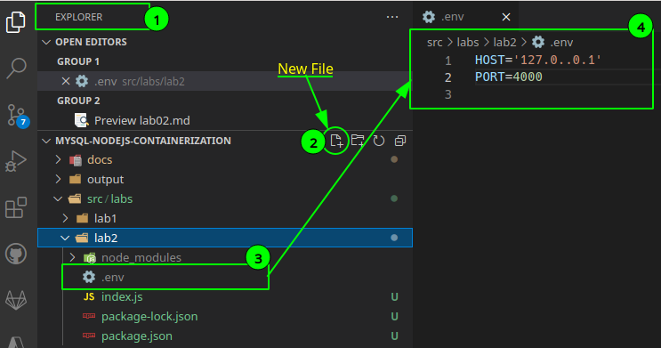
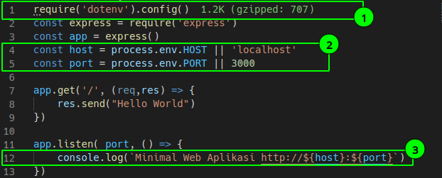
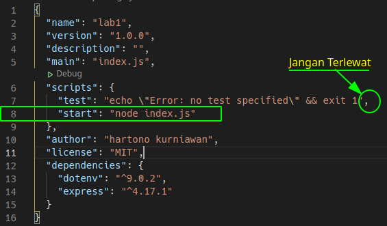

# Menggunakan Environment Variable

<!-- @import "[TOC]" {cmd="toc" depthFrom=1 depthTo=6 orderedList=false} -->

<!-- code_chunk_output -->

- [Menggunakan Environment Variable](#menggunakan-environment-variable)
  - [Tujuan Instruksional Khusus](#tujuan-instruksional-khusus)
  - [Kebutuhan perangkat lunak](#kebutuhan-perangkat-lunak)
  - [Studi Kasus:](#studi-kasus)
  - [Instruksi](#instruksi)
    - [Langkah 1: Tambahkan Pustaka dotenv (5 menit)](#langkah-1-tambahkan-pustaka-dotenv-5-menit)
    - [Langkah 2: Tambahkan berkas dotenv dan buat environment variable (5 menit)](#langkah-2-tambahkan-berkas-dotenv-dan-buat-environment-variable-5-menit)
    - [Langkah 3: Jalankan Web Aplikasi](#langkah-3-jalankan-web-aplikasi)

<!-- /code_chunk_output -->


## Tujuan Instruksional Khusus

- Setelah menyelesaikan instruksi pada setiap langkah, Peserta akan dapat  mengatur *variable* yang digunakan pada aplikasi melalui *environment variable* sehingga aplikasi menjadi lebih aman dan mudah di konfigurasikan.

## Kebutuhan perangkat lunak

- Sama dengan kebutuhan perangkat lunak pada **[Lingkungan Pengembangan Aplikasi](./lab01.md)**

## Studi Kasus:

- Web Aplikasi port pada [Lingkungan Pengembangan Aplikasi](./lab01.md), ditulis pada file index.js, sehingga jika ingin merubah nilai pada port harus merubah berkas index.js. Dengan menggunakan Environment Variable merubah nilai default pada variable dapat di letakkan pada satu berkas yang sama yaitu dotenv (.env), dengan demikian pengaturannya menjadi lebih mudah.

## Instruksi

### Langkah 1: Tambahkan Pustaka dotenv (5 menit)

- Buat folder lab2  pada subfolder labs
```
c:\> cd
..\labs
c:\> mkdir lab2
```
- Salin berkas index.js, package.json ke folder lab2 dari folder lab1

```
c:\> cd
..\labs
c:\> copy lab1/index.js lab1/package.json lab2
c:\> npm install dotenv --save
```

- Aktifkan folder lab2

```
c:\> cd
..\lab2
```

- Tambahkan pustaka dotenv

```
c:\> npm install --save dotenv
```
### Langkah 2: Tambahkan berkas dotenv dan buat environment variable (5 menit)

- Melalui explorer, buat berkas baru .env difolder lab2, dan tambahkan nilai pada environment variable HOST dan PORT.



> Catatan:
> 1. Letakkan mouse pada EXPLORER
> 2. Pada folder lab2, click icon New File, untuk membuat berkas baru.
> 3. Beri nama berkas dengan ".env"
> 4. Buat nilai pada variable HOST dengan "127.0.0.1" atau boleh dengan 'localhost' dan variable PORT dengan 4000.

- Ubah berkas index.js menjadi sebagai berikut:



> Catatan:
> 1. Tambahkan kode `require('dotenv').config()` pada awal baris
> 2. Gunakan *environment variable* pada variable host dan port, tanda || digunakan untuk memberikan nilai tetap (*default*) jika pada *environment variable* pada .env tidak di berikan nilai.
> 3. Gunakan String interpolasi untuk menampilkan nilai variable host dan port.

### Langkah 3: Jalankan Web Aplikasi

- Menjalankan aplikasi dengan **npm start** membuat aplikasi nodejs menjadi standard sehingga lebih mudah digunakan oleh pengguna lain. Buka file **package.json** dan tambahkan script sebagai berikut:



- Jalankan aplikasi NodeJS dengan menggunakan perintah berikut:

```
c:\> npm start
```

- Akses aplikasi dengan curl atau browser favorit melalui url

```
http://127.0.0.1:4000
```
---
